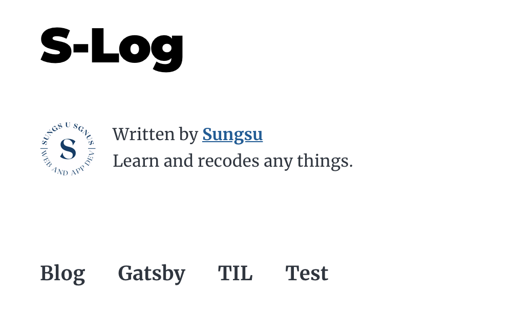

### 블로그 개시물을 카테고리별로 분류하자


지금은 포스팅한 개시물이 별로 없어서 상관 없지만

나중을 위해선 카테고리별로 분류해주는게 좋을것 같다.

우선 Markdown 파일에 ```categories``` 항목을 추가해 각 파일별로 카테고리 이름을 부여해놨고

graqhql을 통해 카테고리를 조회했다.

```js
`
  {
    allMarkdownRemark {
      group(field: frontmatter___categories) {
        fieldValue
      }
    }
  }
`

```

우선 components 폴더에 ```categories.js``` 파일을 만들고 기본적인 설정만 해놨다

```js
import * as React from 'react';
import styled from 'styled-components'

const CategoryStyle = styled.div`
  display:flex;
  flex-direction: row;
  gap: 2rem;

  font-size: 1.2rem;
  font-weight: bold;

  list-style: none;
`;

const Categories = ({ children }) => {


  return (
    <CategoryStyle>
    {children}
    </CategoryStyle>
  )
}

export default Categories;
```

그리고 이제 ```index```파일에서
map 함수를 이용해 frontmatter 의 categories 아이템을 하나씩 가져와 표시하도록 했다

```js
const Index = ({ data, location }) => {

  const { group } = data.allMarkdownRemark

  return (
    //... 중략
      <Categories>
        {group.map(prop => {
          
          const { fieldValue } = prop

          return (
            <li
            key={fieldValue}
            >
              {fieldValue}
            </li>
            )
          }
        )}
      </Categories>
    //...이하 생략

```



다음은 카테고리 항목별로 조회할 수 있도록 이벤트를 만들어보자