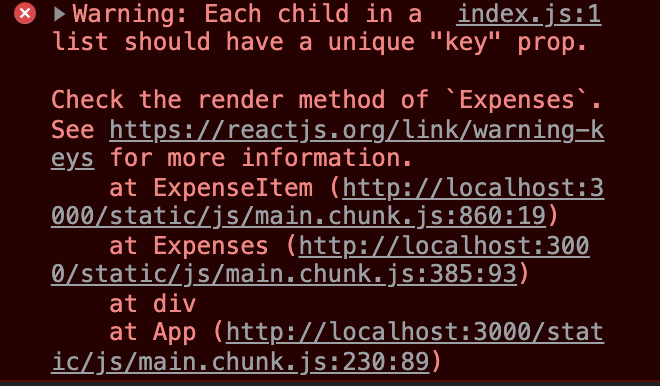

## React Each child in a list should have a unique "key" prop. 리액트 키값 오류

 

```js
{
  props.items.map(data => (
    <example title={data.title} amount={data.amount} date={data.date} />
  ))
}
```

map 함수를 통해 컴포넌트를 렌더링 하니 에러가 발생된다

결과물은 이상없이 나타나는데 왜 에러가 나타나는가?

이유는 key값을 설정하지 않았기 때문이다.

해결방법

출력하려는 데이터에 에 key 또는 id 항목을 만들고, 함수를 통해 key값을 추가해주면 이상이 없어진다.

```js
const Data = [
  {
    id: "e1",
    title: "data1",
    amount: 94.12,
    date: new Date(2021, 7, 14),
  },
  {
    id: "e2",
    title: "data2",
    amount: 799.49,
    date: new Date(2021, 2, 12),
  },
  {
    id: "e3",
    title: "data3",
    amount: 294.67,
    date: new Date(2021, 2, 28),
  },
  {
    id: "e4",
    title: "data4",
    amount: 450,
    date: new Date(2021, 5, 12),
  },
]
```

```js
{
  props.items.map(data => (
    <example
      title={data.title}
      amount={data.amount}
      date={data.date}
      key={data.id}
    />
  ))
}
```
