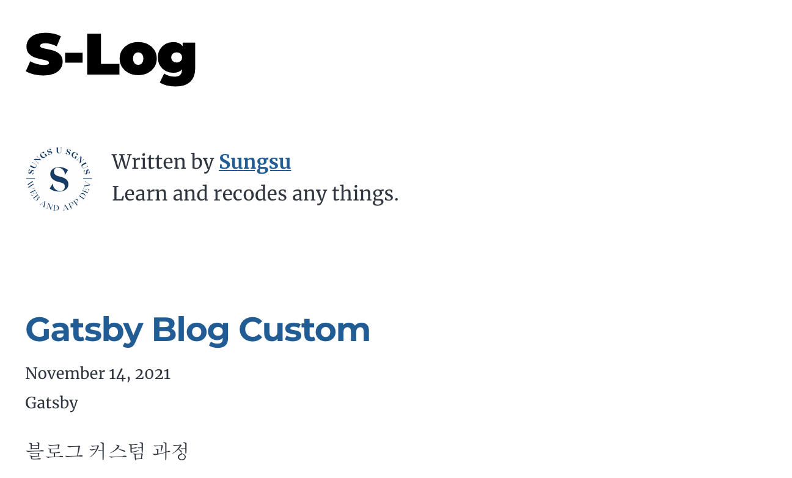
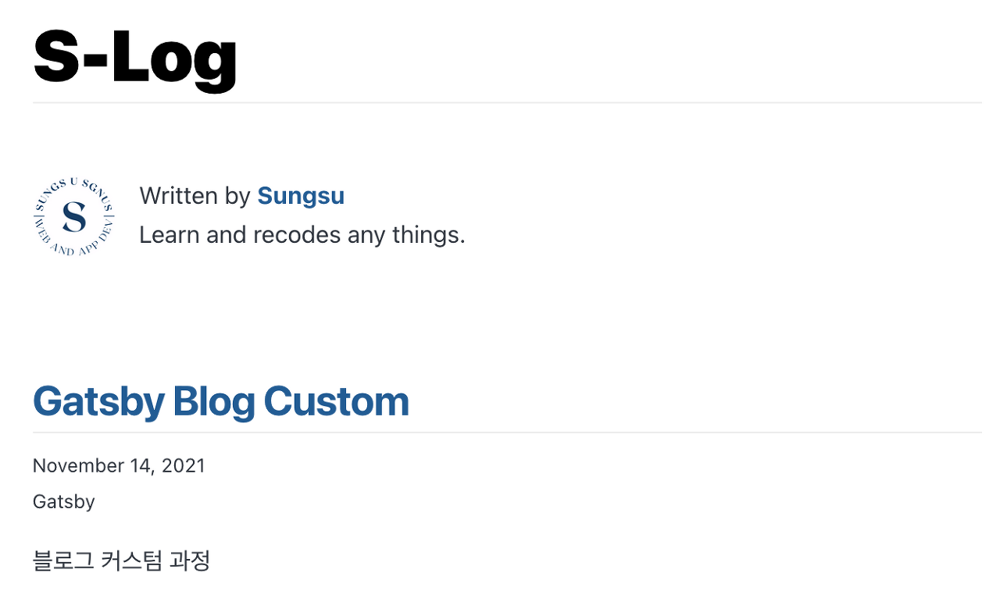

> https://www.gatsbyjs.com/docs/using-typography-js/ 문서를 정리한 글 입니다.

gatsby-starter 테마를 통해 블로그를 만들었는데 글꼴이 상당히 마음에 들지 않는다.

 

<br />

영어는 괜찮은데 한글을 지원하지 않아 얼른 바꾸고싶은 마음이 든다.

글꼴 바꾸는 방법을 찾아보다가 gatsby 공식 문서에 나와있는 방법을 적용하니 간단하게 적용이 잘 되어 공유하고자 한다.

우선 Typography를 설치하고 gatsbt-config 에 추가해준다.

```node
npm install gatsby-plugin-typography react-typography typography
```

```js
gatsby - config

module.exports = {
  plugins: [
    {
      resolve: `gatsby-plugin-typography`,
      options: {
        pathToConfigModule: `src/utils/typography`,
      },
    },
  ],
}
```

이후 src 폴더 안에 utils라는 폴더를 만든뒤 typography.js 파일을 생성한 뒤 아래 내용을 추가한다

```js
src / utils / typography.js

import Typography from "typography"
const typography = new Typography()

export default typography
```

그리고 http://kyleamathews.github.io/typography.js/ 사이트에 접속해서 하단으로 내리다보면

Published Typography.js Themes

부분에서 미리 만들어진 폰트 테마들을 확인할 수 있다.

나는 Github 테마를 골랐고 내가 고른 테마를 클릭하면 테마 설치 방법이 나오는 깃허브 사이트로 접속된다.

해당 테마를 install 하고

```node
npm install --save typography typography-theme-github
```

typography.js 파일에 추가한다

```js
import Typography from "typography"
import githubTheme from "typography-theme-github"

const typography = new Typography(githubTheme)

export default typography
```



폰트가 깔끔해져서 기분이 좋다
