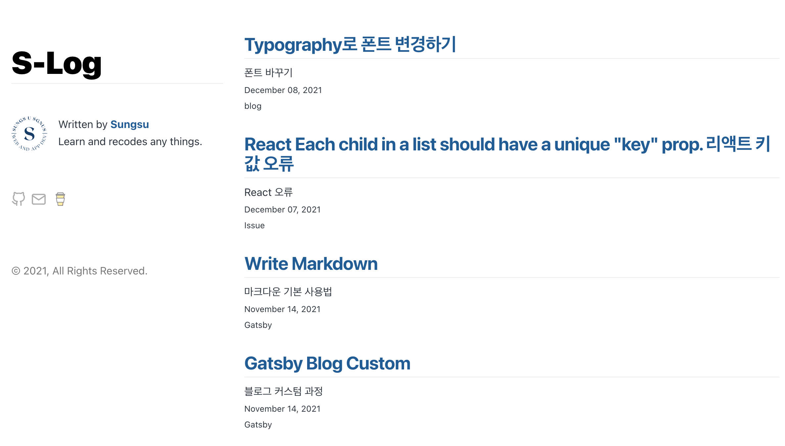
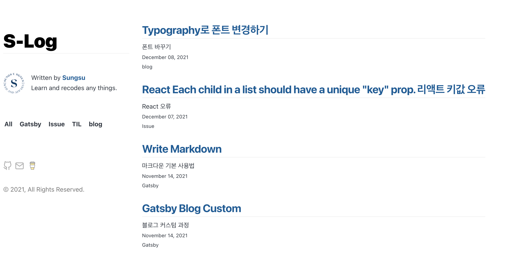

개츠비 블로그를 커스텀하다보니 개시물을 카테고리별로 분류하고 싶어졌다.

처음부터 카테고리가 있는 테마를 쓰면 편하지만 불편한게 끌리는건 왜인지 모르겠다.



좌측 배너 중간쯤에 카테고리들을 나열하고 카테고리를 클릭하면 해당 카테고리에 해당하는 포스트만 나타낼것이다.

다른 블로그를 찾아보니 page에 새로운 것을 추가하고 gatsby-node를 설정하는등 여러 방법이 있는듯 하나

나는 그냥 조건문을 이용해 렌더링 할것이다.

우선 카테고리를 표시하기 위해 새로운 컴포넌트를 만들었다 이름은 categories.js

모든 개시물을 나타낼 All 카테고리는 임의로 생성해놨다.

```js
import React from "react"
import { graphql } from "gatsby"

const Categories = ({ data }) => {
  const { group } = data.allMarkdownRemark

  return (
    <ol className="category-box">
      <li key={"All"} className="categories">
        All
      </li>
      {group.map(prop => {
        const { fieldValue } = prop
        return (
          <li key={fieldValue} className="categories">
            {fieldValue}
          </li>
        )
      })}
    </ol>
  )
}
export default Categories

export const pageQuery = graphql`
  query {
    site {
      siteMetadata {
        title
      }
    }
    allMarkdownRemark(sort: { fields: [frontmatter___date], order: DESC }) {
      nodes {
        excerpt
        fields {
          slug
        }
        frontmatter {
          date(formatString: "MMMM DD, YYYY")
          title
          description
          categories
        }
      }
      group(field: frontmatter___categories) {
        edges {
          node {
            id
          }
        }
        fieldValue
        totalCount
      }
    }
  }
`
```

layout으로부터 { data } 를 받아와 이렇게 세팅을 해주고 layout파일에 추가해줬다

```js
//layout.js

...
<div className="global-wrapper" data-is-root-path={isRootPath}>
  <header className="global-header">
    <h1 className="main-heading">
    	<Link to="/">{title}</Link>
    </h1>
    <Bio />
    <Categories data={data} />
    <Sns />
    <footer className="footer">
    © {new Date().getFullYear()}, All Rights Reserved.
    </footer>
  </header>
  <main>{children}</main>
</div>
...
```



이제 카테고리들이 잘 나타나고 있다.

다음 개시물에서 카테고리별로 개시물을 분류하자
