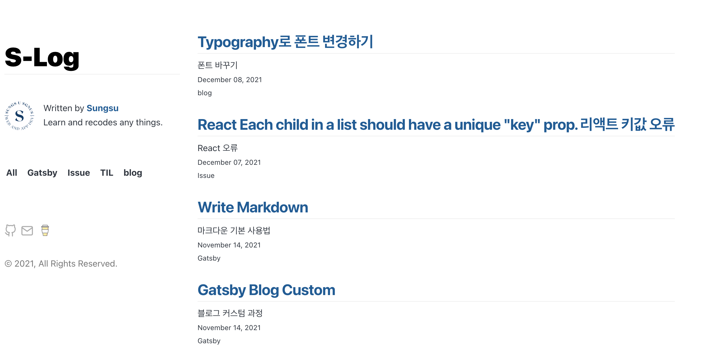

카테고리 목록을 화면에 출력시키긴 했지만 아무 동작도 하지 않는다

우선 카테고리에 클릭 이벤트를 추가해주자

```js
//categories.js

const Categories = ({ data, onChangeCat }) => {
  const { group } = data.allMarkdownRemark
  const clickHandler = event => {
    console.log(event.target.innerText)
  }

  return (
    <ol className="category-box">
      <li
        key={"All"}
        className="categories"
        onClick={clickHandler}
        onKeyPress={clickHandler}
        role="presentation"
      >
        All
      </li>
      {group.map(prop => {
        const { fieldValue } = prop
        return (
          <li
            key={fieldValue}
            className="categories"
            onClick={clickHandler}
            onKeyPress={clickHandler}
            role="presentation"
          >
            {fieldValue}
          </li>
        )
      })}
    </ol>
  )
}

/*
여기서 onKeyPress={clickHandler}  와  role="presentation"를 추가한 이유는
비대화형 요소에 마우스 또는 키보드 이벤트를 제공하려고 할 때마다 
표준에 따라 대화형 요소에서만 이러한 이벤트를 사용하도록 강제하기 때문이라는데 
추가하지 않으면 경고가 나타나므로 추가한다
*/
```

이제 콘솔에 이벤트가 출력되는지 확인해보자


<br />

정상적으로 출력된다면 index.js에서 활용을 하자

현재 폴더 구조는 index의 자식으로 layout이 있고 그 자식으로 categories가 있다

그러므로 index에서 useState를 통해 카테고리를 사용할 함수를 만들어주고 그 함수를 categories와 주고받으면 된다.

```js

//index.js

...
  const [filteredCat, setFilteredCat] = useState("All")

  const filterCatHandler = selected => {
    setFilteredCat(selected)
  }

  console.log(filteredCat)

  ...

  <Layout
        location={location}
        title={siteTitle}
        data={data}
        onChangeCat={filterCatHandler}
      >
       ...
</Layout>

...
```

state의 기본값은 All로 설정해두고

categories에 filterCatHandler 함수를 전달해 setFilteredCat 을 사용하면

filteredCat의 값이 카테고리를 클릭할 때마다 변경된다.

index에서 layout으로 함수를 전달했으니 layout에서 categories로 한번더 전달해준다

```js

//layout.js

...
<Categories data={data} onChangeCat={onChangeCat} />
...


//categories.js

const Categories = ({ data, onChangeCat }) => {
  const { group } = data.allMarkdownRemark
  const clickHandler = event => {
    onChangeCat(event.target.innerText)
  }

  return (
    <ol className="category-box">
      <li
        key={"All"}
        className="categories"
        onClick={clickHandler}
        onKeyPress={clickHandler}
        role="presentation"
      >
        All
      </li>
      {group.map(prop => {
        const { fieldValue } = prop
        return (
          <li
            key={fieldValue}
            className="categories"
            onClick={clickHandler}
            onKeyPress={clickHandler}
            role="presentation"
          >
            {fieldValue}
          </li>
        )
      })}
    </ol>
  )
}
```

export default Categories
categories에서 index로부터 전달받은 함수를 실행시켜 filteredCat의 값을 변경해준다.

이제 필터링된 값을 전달받고 있으니 index에서 전달받은 값과 동일한 카테고리를 갖고있는 개시물만 출력해주면 되겠다.

```js
//index.js

...

  const [filteredCat, setFilteredCat] = useState("All")

  const filterCatHandler = selected => {
    setFilteredCat(selected)
  }
	if (filteredCat === "All") {
    return (
      <Layout
        location={location}
        title={siteTitle}
        data={data}
        onChangeCat={filterCatHandler}
      >

      ...

        <ol>
          {posts.map(post => {
            const title = post.frontmatter.title || post.fields.slug

            return (
              <li key={post.fields.slug}>
                <article
                  className="post-list-item"
                  itemScope
                  itemType="http://schema.org/Article"
                >
                  <header>
                    <h2>
                      <Link to={post.fields.slug} itemProp="url">
                        <span itemProp="headline">{title}</span>
                      </Link>
                    </h2>
                    <p
                      dangerouslySetInnerHTML={{
                        __html: post.frontmatter.description || post.excerpt,
                      }}
                      itemProp="description"
                    />
                    <small>{post.frontmatter.date}</small>
                    <br />
                    <small>{post.frontmatter.categories}</small>
                  </header>
                  {/* <section></section> */}
                </article>
              </li>
            )
          })}
        </ol>
      </Layout>
    )
  }
  	else {
    const filterExpenses = posts.filter(post => {
      return post.frontmatter.categories === filteredCat
    })
    return (
      <Layout
        location={location}
        title={siteTitle}
        data={data}
        onChangeCat={filterCatHandler}
      >
        ...

        <ol>
          {filterExpenses.map(post => {
            const title = post.frontmatter.title || post.fields.slug

            return (
              <li key={post.fields.slug}>
                <article
                  className="post-list-item"
                  itemScope
                  itemType="http://schema.org/Article"
                >
                  <header>
                    <h2>
                      <Link to={post.fields.slug} itemProp="url">
                        <span itemProp="headline">{title}</span>
                      </Link>
                    </h2>
                    <p
                      dangerouslySetInnerHTML={{
                        __html: post.frontmatter.description || post.excerpt,
                      }}
                      itemProp="description"
                    />
                    <small>{post.frontmatter.date}</small>
                    <br />
                    <small>{post.frontmatter.categories}</small>
                  </header>
                  {/* <section></section> */}
                </article>
              </li>
            )
          })}
        </ol>
      </Layout>
    )
  }
}
```

이제 All을 누르면 모든 개시물이 카테고리를 클릭해면 해당 카테고리에 맞는 개시물들이 나타날것이다.
