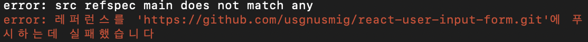

레포지터리를 새로 만들고 처음 로컬 디렉토리를 연결하려 하는데 에러가 발생된다

 

이유는 push를 할 때 commit한 내용이 없기 때문에 server에 추가할것이 없기 때문이다.

레포지터리에 추가할 파일이 없다는 뜻이고 commit할 내용을 만들어 다시 push하면 문제는 해결된다

```bash

git init

git add .

git commit -m "first commit"

git push -u origin main

```
