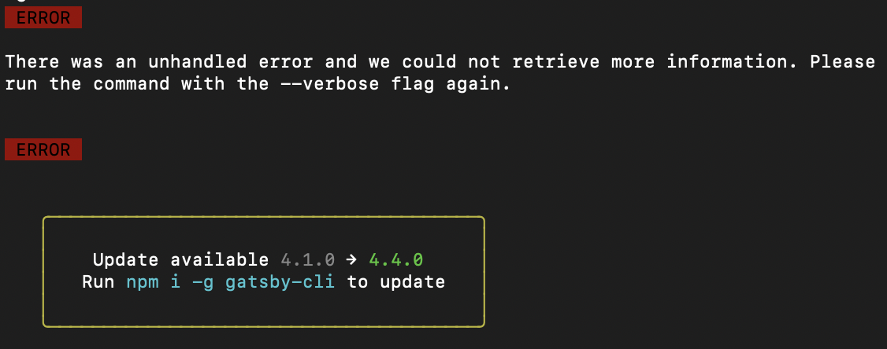
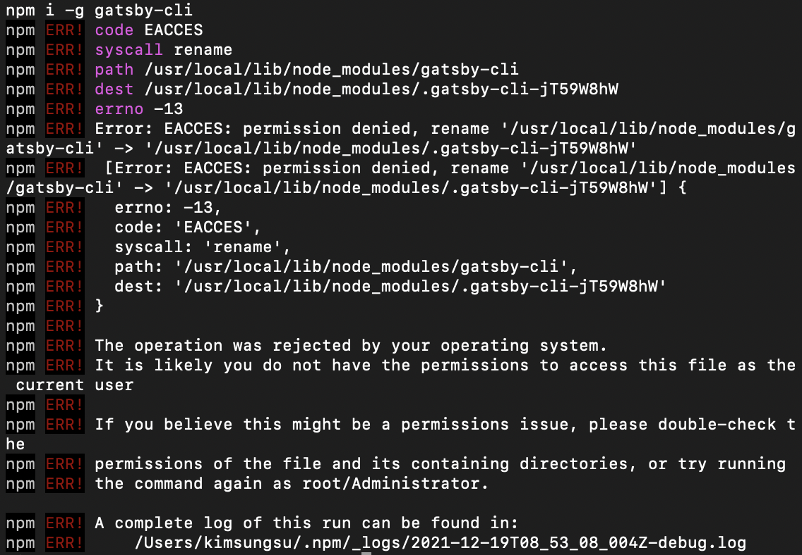
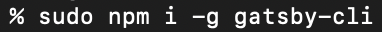
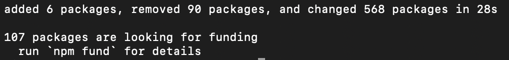

### npm install issue The operation was rejected by your operating system. npm ERR

블로그 외부 링크 클릭시 새창으로 열기 위해 \_blank 태그를 추가하니 경고가 나타났다.

 

gatsby 블로그 작업 종료 후 에러가 나타나서 보니 gatsby 업데이트를 하라는것 같아서 업데이트를 진행했더니 오류가 발생된다.

파일에 액세스 할 권한이 없다고 한다.

해결 방법으로 관리자 권한을 부여해 다시 명령을 실행해준다.

이제 정상적으로 설치가 된다.

