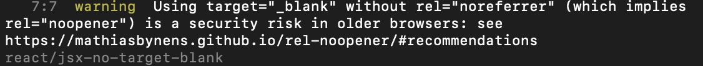

### Using target=\_blank without rel=noopener noreferrer is a security risk 이슈

블로그 외부 링크 클릭시 새창으로 열기 위해 \_blank 태그를 추가하니 경고가 나타났다.



이게 무슨 문제인가 찾아보니 Tabnabbing 피싱 공격에 노출될 수 있기 때문이라 한다.

Tabnabbing 피싱 공격이란 target_blank인 태그를 클릭하였을 때

새롭게 열린 탭에서 기존 페이지를 피싱페이지로 바꿔 정보를 탈취하는 피싱 공격인데

A 페이지에서 B 링크를 새 창으로 접속하면

탭에 있는 A 페이지가 나도 모르는 새에 C 페이지로 바뀌어 있는 것이다.

해결 방법으로는
target=”\_blank” 와 rel=”noopener noreferrer”
를 같이 적용한다.

rel=”noopener noreferrer”는

rel=noopener 속성이 부여된 링크를 통해 열린 페이지에서 자바스크립트 요청을 거부한다.

쉽게 A페이지의 정보를 바꾸지 못하는 것이다.

```html
<a href="https://www.my-site.com" target="_blank">My site</a>
```

기존 코드를 아래와 같이 변경해준다.

```html
<a href="https://www.my-site.com" target="_blank" rel="noopener noreferrer">
  My site
</a>
```
