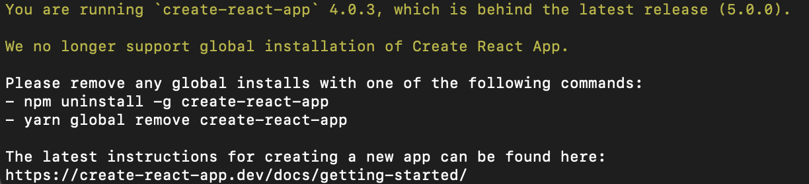
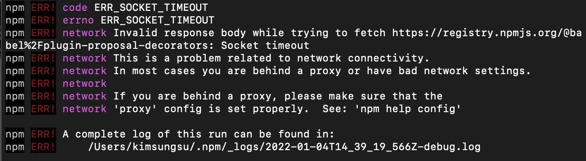
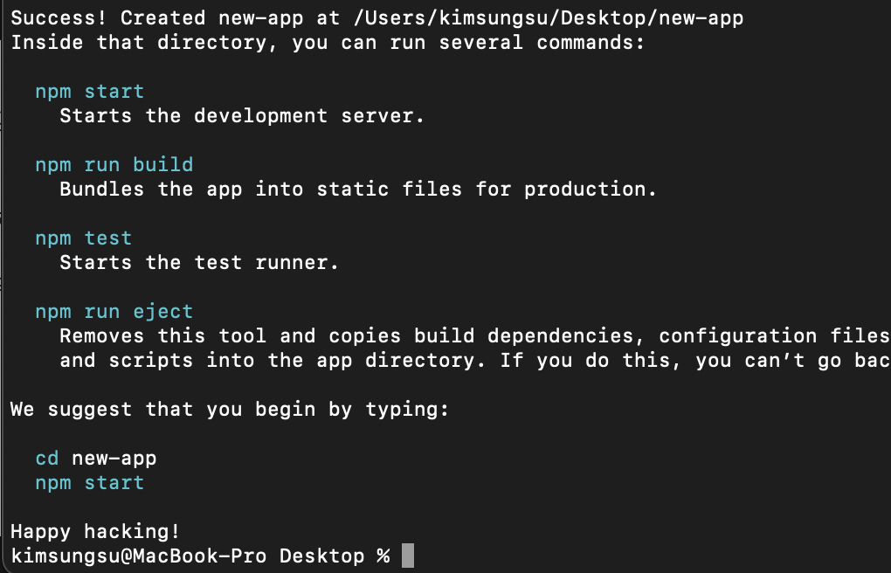

새로운 프로젝트를 생성하기 위해 `npx create-react-app`를 실행하니 오류가 발생했다.

에러 메세지에서 CRA를 제거하라고 하니 재설치 후 다시 실행해보자

- `npm uninstall -g create-react-app` 로 제거하고
- `npm add create-react-app` 명령어로 다시 설치한뒤
- `npx create-react-app new-app` 명령어를 실행한다.

예상과 다르게 새로운 에러가 발생한다.

찾아보니 인터넷 연결의 문제라고 한다.

기본적으로 1분이면 모든 패키지를 다운로드하기에 충분할것이라 설정되있지만 오래 걸려 나타난 문제인듯 하다.

터미널 루트 디렉토리에서 `npm config set fetch-retry-maxtimeout 60000 -g` 명령 실행 후 다시 CRA를 실행해보자.

이제 정상적으로 작동한다.

## Reference

> [JINSUNG LEE 님 블로그](https://velog.io/@milkyway/React-%EC%98%A4%EB%A5%98-%ED%95%B4%EA%B2%B0-You-are-running-create-react-app-4.0.2-which-is-behind-the-latest-release-4.0.3)
>
> [FacebookGithub](https://github.com/facebook/create-react-app/issues/10251)
