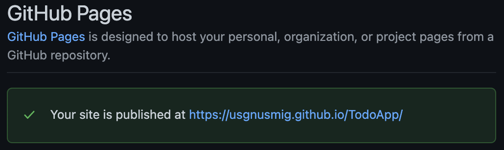

프로젝트를 로컬에서 완성하고 업로드 해놓고 싶다.

github에 호스팅을 하려면 gh-pages 모듈이 필요하다.

```bash
cd myapp
npm install gh-pages --save-dev
```

package.json의 devDependencies에 추가되었는지 확인한다.

```js
{
  ...
  "devDependencies": {
    "gh-pages": "^3.2.3"
    },
  ...
}
```

packages.json을 수정해보자

```js
{
  "homepage": "https://usgnusmig.github.io/todoApp",
  ...
  "scripts": {
    ... "predeploy": "react-scripts build",
    "deploy": "gh-pages -d build",
    ...
  },
  ...
}
```

homepage에 https://<사용자이름>.github.io/<저장소이름> 값을,
scripts는 predeploy와 deploy를 넣는다.

predeploy는 deploy전에 실행 된다

설정을 마쳤으면 배포를 한다

```
$ yarn deploy
```

위 명령어를 수행하면, predeploy가 먼저 실행되어 프로젝트 빌드가 수행된다.

빌드가 완료되면 deploy가 실행되어 github page에 호스팅이 된다

이제 Git 저장소의 settings로 가 'Check it out here!'을 클릭하고


아래와 같이 화면이 나타나면 성공이다.


# Reference

출처: https://memostack.tistory.com/261 [MemoStack]
https://www.npmjs.com/package/gh-pages
